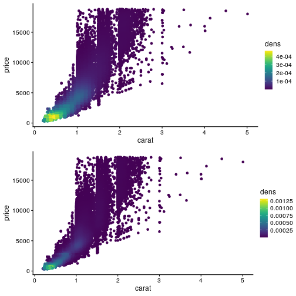
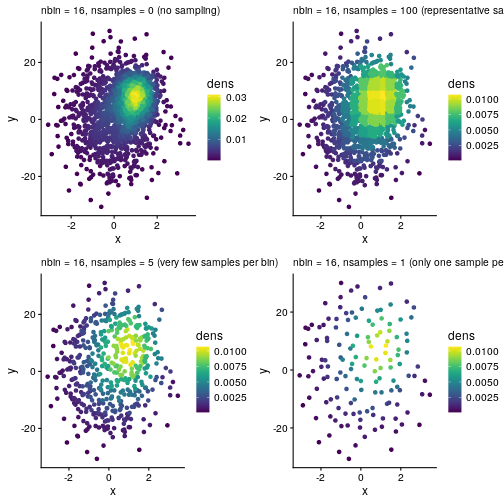

# Geom `geom_pointbin`

The R package
[ggpointdensity](https://github.com/variani/ggpointdensity) implements
two methods for 2D density estimation for the `geom_pointdensity` geom,
nearest neighbors (`method="default"`) and a kernel density approach
`kde2d` (`method="kde2d"`) from the MASS package. These two methods can
be rather slow when datasets are large (\>100,000 observations) and/or
the disribution is not Gaussian.

A new geom `geom_pointbin` is based on the average shifted histogram
implemented in the R package
[ash](https://cran.r-project.org/web/packages/ash/) and found to be both
accurate and computationally efficient [(Deng and
Wickham, 2011)](https://vita.had.co.nz/papers/density-estimation.pdf).

``` r
library(ggpointdensity)

library(ggplot2)
library(dplyr)
library(viridis)

library(cowplot)
theme_set(theme_cowplot(12))
```

## `geom_pointbin` accuracy

``` r
N = 1e3
dat = bind_rows(
  tibble(x = rnorm(N, sd = 1), y = rnorm(N, sd = 10), group = "foo"),
  tibble(x = rnorm(N, mean = 1, sd = .5), y = rnorm(N, mean = 7, sd = 5), group = "bar"))
```

``` r
p_base = ggplot(data = dat, mapping = aes(x = x, y = y))

p_nn = p_base + 
  geom_pointdensity(method = "default") +
  scale_color_viridis()

p_kde = p_base + 
  geom_pointdensity(method = "kde2d") +
  scale_color_viridis()

p_bin = p_base + 
  geom_pointbin() +
  scale_color_viridis()

p_bin2 = p_base + 
  geom_pointbin(nbin = 16) +
  scale_color_viridis()

plot_grid(
  p_nn + labs(subtitle = 'geom_pointdensity(method = "default")'),
  p_kde + labs(subtitle = 'geom_pointdensity(method = "kde2d")'),
  p_bin + labs(subtitle = 'geom_pointbin()'),
  p_bin2 + labs(subtitle = 'geom_pointbin(nbin = 16)'))
```


## Support of ggplot2 features

``` r
p_bin + facet_wrap( ~ group)
```


``` r
p_bin + xlim(c(-3, 0))
#> Warning: Removed 1474 rows containing non-finite values
#> (`stat_point_bin()`).
```


## `geom_pointbin` computational efficiency

``` r
data(diamonds, package = "ggplot2")
```

``` r
p_diamonds_base = ggplot(diamonds, aes(x = carat, y = price))
p_diamonds_bin = p_diamonds_base + 
  geom_pointbin() + scale_color_viridis()
ggplot2::benchplot(p_diamonds_bin)
```


    #>        step user.self sys.self elapsed
    #> 1 construct     0.000    0.000   0.000
    #> 2     build     0.107    0.004   0.110
    #> 3    render     0.054    0.004   0.062
    #> 4      draw     0.862    0.000   0.863
    #> 5     TOTAL     1.023    0.008   1.035

``` r
p_diamonds_kde = p_diamonds_base +
  geom_pointdensity(method = "kde2d") + scale_color_viridis()
ggplot2::benchplot(p_diamonds_kde)
```


    #>        step user.self sys.self elapsed
    #> 1 construct     0.000    0.000   0.000
    #> 2     build     1.571    0.188   1.783
    #> 3    render     0.057    0.000   0.062
    #> 4      draw     0.861    0.000   0.861
    #> 5     TOTAL     2.489    0.188   2.706

``` r
p_diamonds_nn = p_diamonds_base +
  geom_pointdensity(method = "default") + scale_color_viridis()
ggplot2::benchplot(p_diamonds_nn)
```


    #>        step user.self sys.self elapsed
    #> 1 construct     0.000    0.000   0.000
    #> 2     build     8.637    0.004   8.650
    #> 3    render     0.058    0.000   0.062
    #> 4      draw     0.866    0.000   0.868
    #> 5     TOTAL     9.561    0.004   9.580

``` r
# default nbin = 64
p_diamonds_nbin64 = p_diamonds_base + 
  geom_pointbin() + scale_color_viridis()
p_diamonds_nbin128 = p_diamonds_base + 
  geom_pointbin(nbin = 128) + scale_color_viridis()

plot_grid(
  p_diamonds_nbin64, 
  p_diamonds_nbin128,
  ncol = 1)
```



## `geom_pointbin` sub-sampling within bins

``` r
# 100 samples per bin
p_bin_samp100 = p_base + 
  geom_pointbin(nbin = 4, nsamples = 100) +
  scale_color_viridis()

# 5 samples per bin
p_bin_samp5 = p_base + 
  geom_pointbin(nbin = 4,nsamples = 5) +
  scale_color_viridis()

# 1 sample per bin
p_bin_samp1 = p_base + 
  geom_pointbin(nbin = 4,nsamples = 1) +
  scale_color_viridis()

plot_grid(
  p_bin, p_bin_samp100,
  p_bin_samp5, p_bin_samp1)
#> Warning: Computation failed in `stat_point_bin()`
#> Computation failed in `stat_point_bin()`
#> Computation failed in `stat_point_bin()`
#> Caused by error in `$<-.data.frame`:
#> ! replacement has 1996 rows, data has 2000
```


