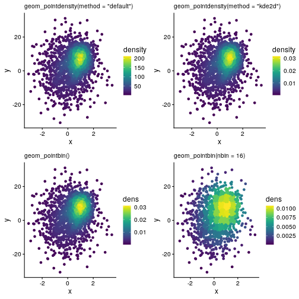
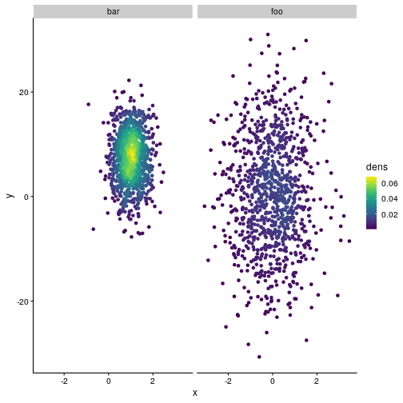
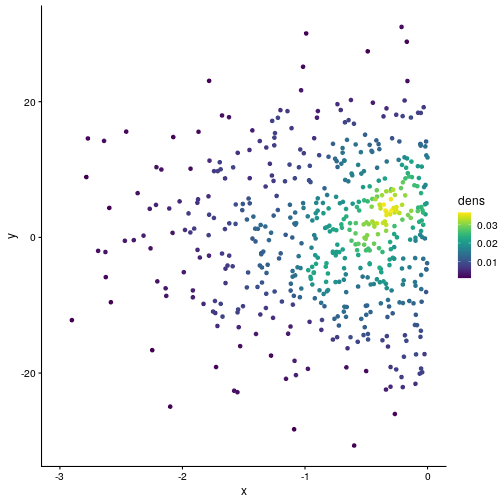

# Geom `geom_pointbin`

The R package
[ggpointdensity](https://github.com/variani/ggpointdensity) implements
two methods for 2D density estimation for the `geom_pointdensity` geom,
nearest neighbors (`method="default"`) and a kernel density approach
`kde2d` (`method="kde2d"`) from the MASS package. These two methods can
be rather slow when datasets are large (\>100,000 observations) and/or
the disribution is not Gaussian.

A new geom `geom_pointbin` is based on the average shifted histogram
implemented in the R package
[ash](https://cran.r-project.org/web/packages/ash/) and found to be both
accurate and computationally efficient [(Deng and
Wickham, 2011)](https://vita.had.co.nz/papers/density-estimation.pdf).

``` r
library(ggpointdensity)

library(ggplot2)
library(dplyr)
#> 
#> Attaching package: 'dplyr'
#> The following objects are masked from 'package:stats':
#> 
#>     filter, lag
#> The following objects are masked from 'package:base':
#> 
#>     intersect, setdiff, setequal, union
library(viridis)
#> Loading required package: viridisLite

library(cowplot)
theme_set(theme_cowplot(12))
```

## `geom_pointbin` accuracy

``` r
N = 1e3
dat = bind_rows(
  tibble(x = rnorm(N, sd = 1), y = rnorm(N, sd = 10), group = "foo"),
  tibble(x = rnorm(N, mean = 1, sd = .5), y = rnorm(N, mean = 7, sd = 5), group = "bar"))
```

``` r
p_base = ggplot(data = dat, mapping = aes(x = x, y = y))

p_nn = p_base + 
  geom_pointdensity(method = "default") +
  scale_color_viridis()

p_kde = p_base + 
  geom_pointdensity(method = "kde2d") +
  scale_color_viridis()

p_bin = p_base + 
  geom_pointbin() +
  scale_color_viridis()

p_bin2 = p_base + 
  geom_pointbin(nbin = 16) +
  scale_color_viridis()

plot_grid(
  p_nn + labs(subtitle = 'geom_pointdensity(method = "default")'),
  p_kde + labs(subtitle = 'geom_pointdensity(method = "kde2d")'),
  p_bin + labs(subtitle = 'geom_pointbin()'),
  p_bin2 + labs(subtitle = 'geom_pointbin(nbin = 16)'))
#> Loading required package: ash
```



## Support of ggplot2 features

``` r
p_bin + facet_wrap( ~ group)
```



``` r
p_bin + xlim(c(-3, 0))
#> Warning: Removed 1491 rows containing non-finite values
#> (`stat_point_bin()`).
```



## `geom_pointbin` computational efficiency

``` r
data(diamonds, package = "ggplot2")
```

``` r
p_diamonds_base = ggplot(diamonds, aes(x = carat, y = price))
p_diamonds_bin = p_diamonds_base + 
  geom_pointbin() + scale_color_viridis()
ggplot2::benchplot(p_diamonds_bin)
```


    #>        step user.self sys.self elapsed
    #> 1 construct     0.000    0.000   0.000
    #> 2     build     0.101    0.012   0.113
    #> 3    render     0.057    0.000   0.061
    #> 4      draw     0.867    0.000   0.875
    #> 5     TOTAL     1.025    0.012   1.049

``` r
p_diamonds_kde = p_diamonds_base +
  geom_pointdensity(method = "kde2d") + scale_color_viridis()
ggplot2::benchplot(p_diamonds_kde)
```


    #>        step user.self sys.self elapsed
    #> 1 construct     0.000    0.000   0.000
    #> 2     build     1.411    0.243   1.662
    #> 3    render     0.058    0.000   0.061
    #> 4      draw     0.871    0.000   0.871
    #> 5     TOTAL     2.340    0.243   2.594

``` r
p_diamonds_nn = p_diamonds_base +
  geom_pointdensity(method = "default") + scale_color_viridis()
ggplot2::benchplot(p_diamonds_nn)
```


    #>        step user.self sys.self elapsed
    #> 1 construct     0.000    0.000   0.000
    #> 2     build     8.646    0.012   8.674
    #> 3    render     0.058    0.000   0.063
    #> 4      draw     0.859    0.000   0.860
    #> 5     TOTAL     9.563    0.012   9.597

``` r
# default nbin = 64
p_diamonds_nbin64 = p_diamonds_base + 
  geom_pointbin() + scale_color_viridis()
p_diamonds_nbin128 = p_diamonds_base + 
  geom_pointbin(nbin = 128) + scale_color_viridis()

plot_grid(
  p_diamonds_nbin64, 
  p_diamonds_nbin128,
  ncol = 1)
```


## `geom_pointbin` sub-sampling within bins

``` r
# 0 samples per bin
p_bin_samp0 = p_base + 
  geom_pointbin(nbin = 16, nsamples = 0) +
  scale_color_viridis()

# 100 samples per bin
p_bin_samp100 = p_base + 
  geom_pointbin(nbin = 16, nsamples = 100) +
  scale_color_viridis()

# 5 samples per bin
p_bin_samp5 = p_base + 
  geom_pointbin(nbin = 16, nsamples = 5) +
  scale_color_viridis()

# 1 sample per bin
p_bin_samp1 = p_base + 
  geom_pointbin(nbin = 16, nsamples = 1) +
  scale_color_viridis()

plot_grid(
  p_bin + labs(subtitle = "nbin = 16, nsamples = 0 (no sampling)"),
  p_bin_samp100 + labs(subtitle = "nbin = 16, nsamples = 100 (representative sampling)"),
  p_bin_samp5 + labs(subtitle = "nbin = 16, nsamples = 5 (very few samples per bin)"),
  p_bin_samp1 + labs(subtitle = "nbin = 16, nsamples = 1 (only one sample per bin)"),
  ncol = 2)
```


